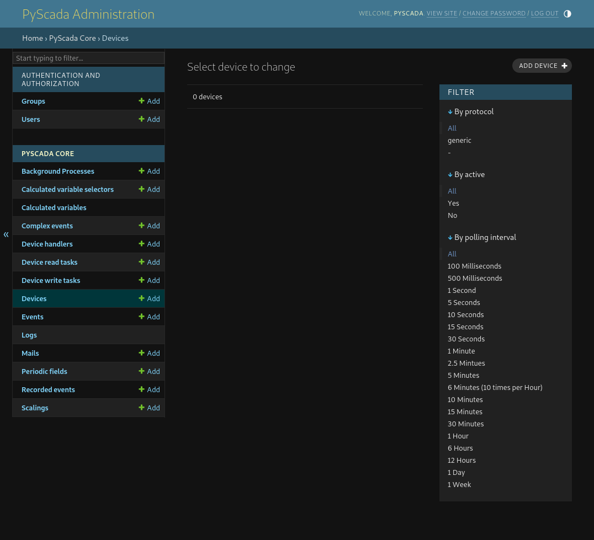
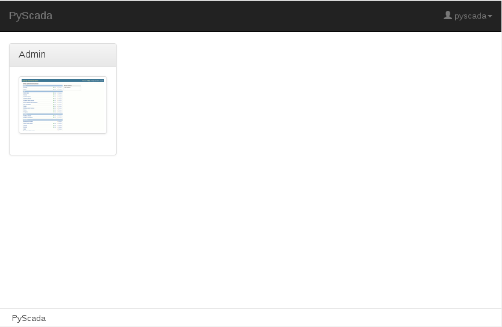
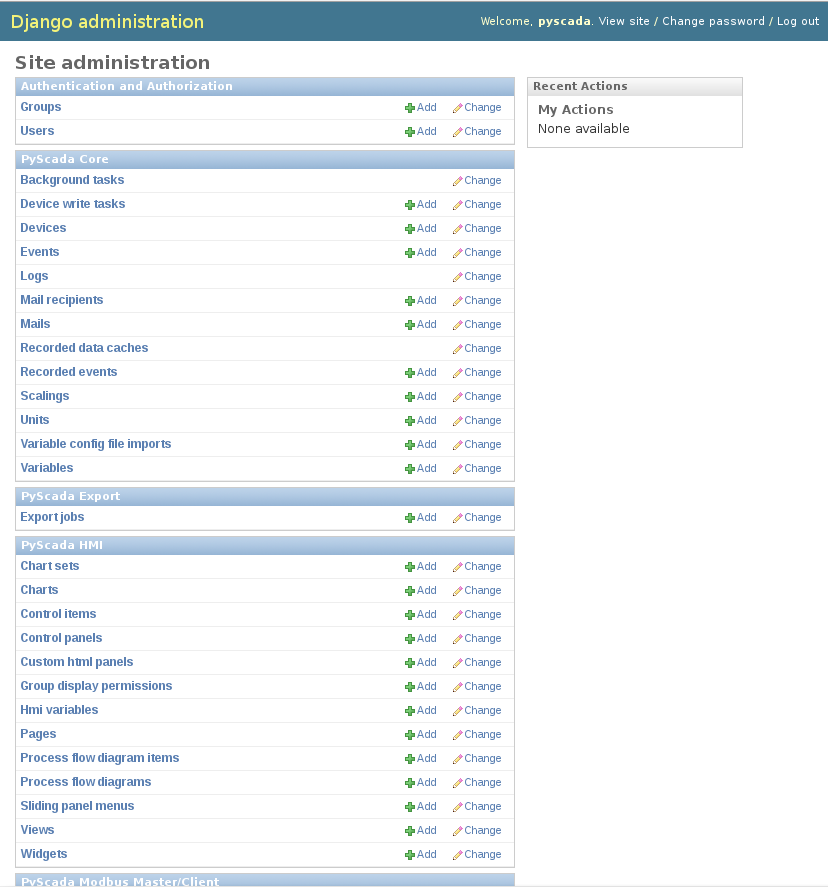
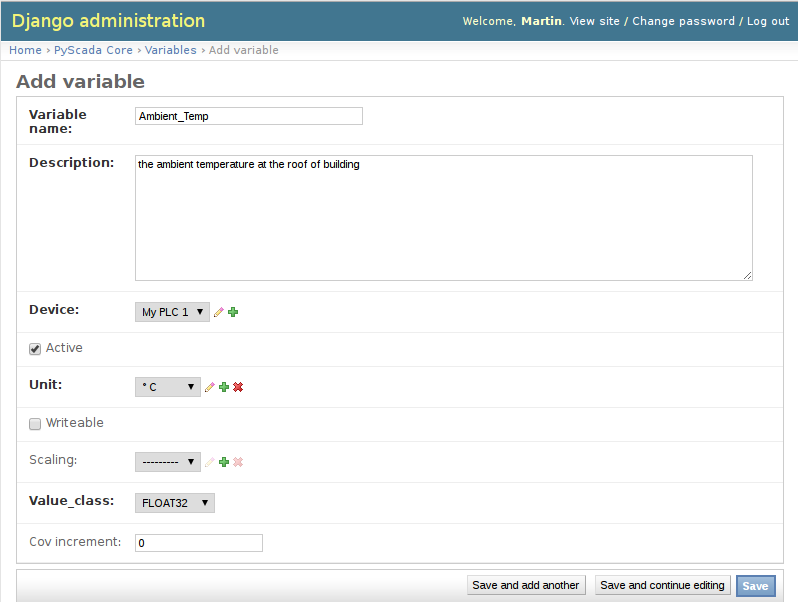
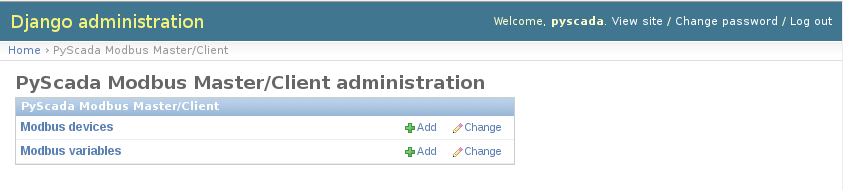
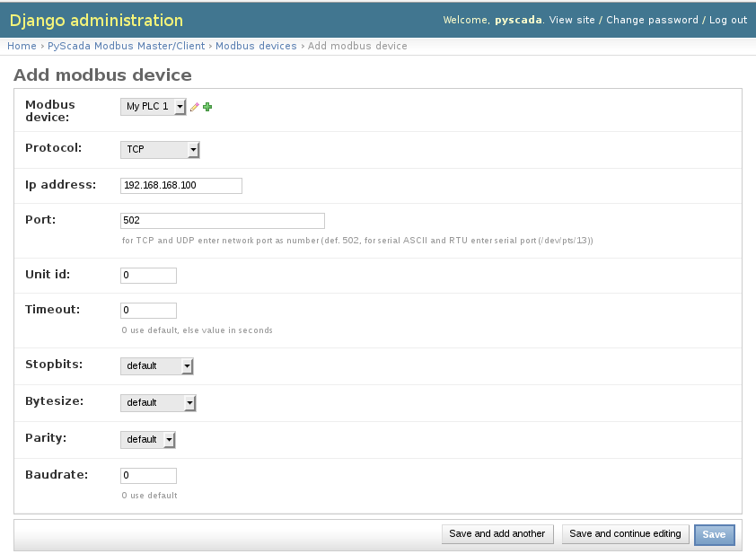
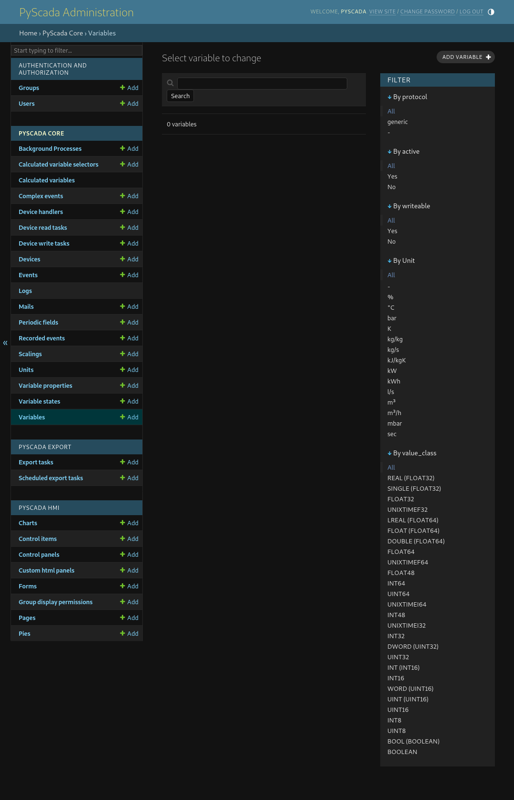
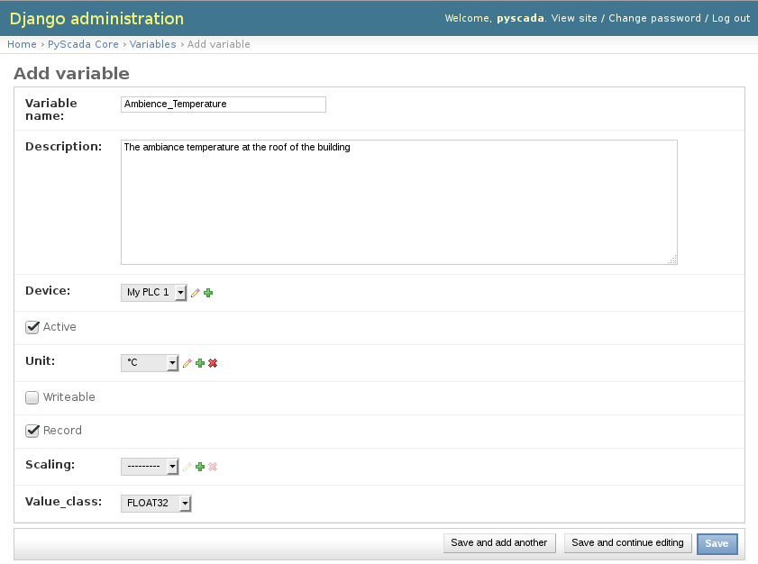
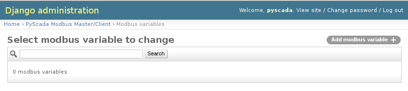

Using the Backend
=================

To use the backend open the HMI in your browser by opening http://127.0.0.1 
(replace 127.0.0.1 withe the IP or hostname of your PyScada server) and sign in 
with your admin account (*TODO link to createsuperuser* doc).

After successful login in your see the view overview, to oben the admin panel 
click on the *Admin* Icon.

Now you are in the backend or Admin panel.

Add a new Device
----------------

To add a new device (e.g. a PLC) open the *Device* Table in the *PyScada Core* 
section.

You will see a empty list, click on *add device* in the upper right corner to 
add a new device (e.g. a modbus device).

We assume we want to add a modbus TCP/IP device (the device act as modbus server, 
while pyscada act as client). 
The invormation related to the modbus device will be set in a seperate table. 
Go to the Admin overview and select *Modbus device* from the 
*PyScada Modbus Master/Client* section.

You will see a empty list. Click on *add modbus device* in the upper right 
corner to add a new device (e.g. a modbus device).

For Modbus IP only the IP-Address, the port of the modbus server and the 
*unit id* are required.

Add a new Variable
------------------

Adding a new variable/data point first add a new *Variable* entry to *Variables* 
table in the *PyScada Core* section of the admin panel, to do so click 
*add variable* in the upper right corner.

A Variable has a name and a description, assign the Variable to a Device and 
select a Unit of measurement (*TODO* add description off adding a new unit), 
activate writable if the value should be changed from the HMI, if the value has 
to be scaled in order to be displayed right select the right scaling 
(*TODO* add description for adding a scaling).

The *value_class* is the data type in witch the value is represented on the Device 
(*TODO* add example). 
The *cov_increment* is the amount of change of the value to be stored in the database.

We assume we want to add a modbus variable. To add the information about the 
register and the function code, add a new modbus variable, to do so open the 
*Modbus variables* table from the *PyScada Modbus Master/Client* section and click 
*add modbus variable* in the upper right corner.

Select the Variable to assign by clicking on the magnifier symbol or writing the 
id of the Variable. Add the register address of the lowes word (a FLOAT32 variable 
on two 16 bit registers 1234 and 1235, 1234 has to be selected ), for boolen 
values provide the address of the bit. For the *Function code read* the function 
code for reading the value from the modbus server has to be selected, for writing 
values to the server the coresponding function code will be selected automaticly 
(*TODO* function code table). 

To use the Variable in the HMI a *Hmi variable* entry has to be added, to do so open 
the *Hmi variable* table in the *PyScada HMI* section and click 
*add hmi variable* in the upper right corner.

*TODO* add picture

Select the Variable to assign by clicking on the magnifier symbol or writing the 
id of the Variable. Provide a *short_name* that will be used in the HMI or leave 
the field blank to use the *name* of the *Variable*. Select the *color* and 
*line thickness* for charts. (a default set of colors can be added by loading 
the color.json fixture, *TODO* link to the commandline example)

*TODO* add picture

Add a new View
--------------

to be continued...

Add a new Page
--------------

to be continued...

Add a new Chart
---------------

to be continued...

Add a new Control Panel
-----------------------

to be continued...

