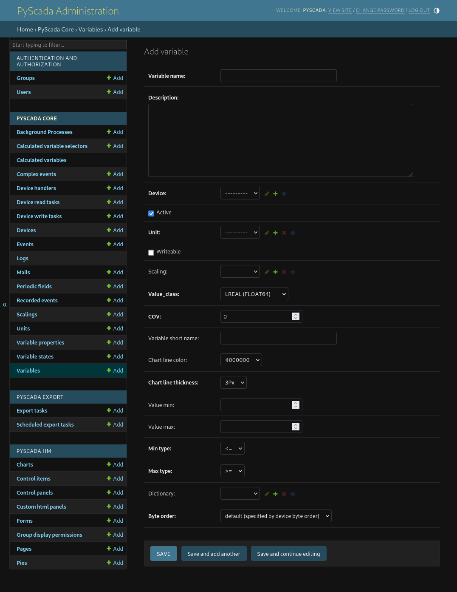

Using the Backend
=================

To use the backend open the HMI in your browser by opening http://127.0.0.1
(replace 127.0.0.1 withe the IP or hostname of your PyScada server) and sign in
with your admin account defined during the :doc:`installation process <../quick_install>`
(*TODO link to createsuperuser* doc).

After successful login in your see the view overview, to open the admin panel
click on your username in the upper right corner and on *Admin*.

Now you are in the backend or Admin panel.

Add a new Device
----------------

To add a new device (e.g. a PLC) open the *Device* Table in the *PyScada Core*
section.

.. image:: pic/backend_core_add_device.png

You will see a empty list. Click on *add device* in the upper right
corner to add a new device (e.g. a modbus device).

* Enter a name and a description.
* Choose a pooling interval (time between two variable value read).
* Choose a protocol.
* Enter the necessary informations for that protocol.

(*TODO device protocol setup*)

Add a new Variable
------------------

Enter to *Variables* table in the *PyScada Core* section of the admin panel.
Click on *add variable* in the upper right corner.

A Variable has a name and a description, assign the Variable to a Device and
select a Unit of measurement (*TODO* add description off adding a new unit),
activate writable if the value should be changed from the HMI, if the value has
to be scaled in order to be displayed right select the right scaling
(*TODO* add description for adding a scaling).

The *value_class* is the data type in witch the value is represented on the Device
(*TODO* add example).

The *Change Of Value (COV)* is the amount of change of the value to be stored in
the database. It will store new values for that variable if :

.. math::

	| new\_value - last\_value | > COV\_value

or if the last value is older than 1 hour.

So if you want to save all the values, set the COV to ``-1``.

Enter the necessary informations for the variable depending of the device protocol.

Short instructions to build the user HMI (frontend)
---------------------------------------------------

In the backend HMI section:

1. Charts, add a new Chart
2. Page, add a Page
3. Widget, add a Widget, select under Page the page you added in 2. and under `Content` the Chart from 1.
	A widget controls the position of every element on a Page.
	Set the position (row, column) and the width of the widget.
4. View, add a View and select the page from 2.
5. (optional) GroupDisplayPermissions, add a new GroupDisplayPermission, (if nessesary add a new Group and add your User to that Group, select all items you created in 1. to 4.)
6. open http://IP/, you should see the new View, if the DAQ is running and there is Data already in the DB, you should see the last 2 Hours of data and the current Data.

The frontend structure :

::

	+-View------------------------------------+
	|                                         |
	| +-Page--------------------------------+ |
	| |                                     | |
	| | +-Widget--------+ +-Widget--------+ | |
	| | |               | |               | | |
	| | | Row 1, Col 1  | | Row 1, Col 2  | | |
	| | | Width 1/2     | | Width 1/2     | | |
	| | | +-Chart-----+ | | +-Chart-----+ | | |
	| | | |           | | | |           | | | |
	| | | +-----------+ | | +---------- + | | |
	| | +---------------+ +---------------+ | |
	| +-------------------------------------+ |
	+-----------------------------------------+

Add a new View
--------------

to be continued...

Add a new Page
--------------

to be continued...

Add a new Chart
---------------

to be continued...

Add a new Control Panel
-----------------------

to be continued...
